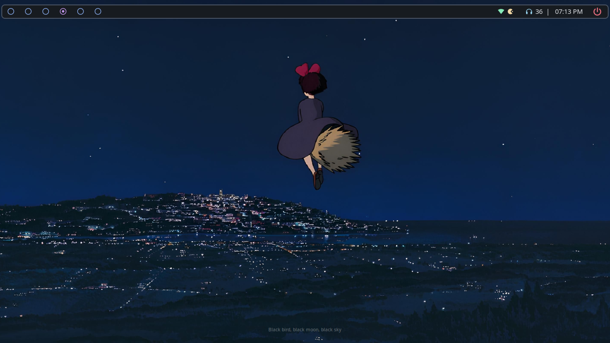
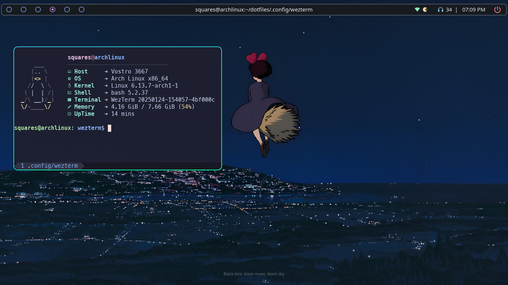
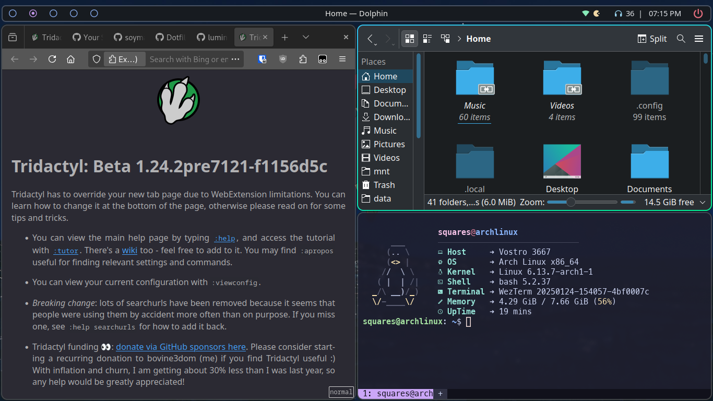

<!-- -------- Header start --------- -->

  <h1 style="color:#f594a0">
    ⚙️ My-Dotfiles 🔧 
  </h1>
  
  
Space for storing my <a href="https://wiki.archlinux.org/title/Dotfiles">dotfiles</a> of DE/WM, programs, services.
      
    Also documentation about them.
  

<!-- -------- Header End --------- -->

<h2 align="center">-----: ScreenShots :-----</h2>

  

      
  

  

    
    
  

 

<h2 align="center">-----: App Utilities :-----</h2>

  
GUI Apps

- **Wezterm** - Gpu Accelarated _Terminal_ with lua as config language.
- **Dolphin** - KDE _File Manager_.
- **KDE Connect** - Control your PC from your Android.
- **LibreWolf** - A custom version of Firefox, focused on privacy, security and freedom.
- **MPV Player** - The Command line video player.
- **VLC Media Player** - Videolan's on-the-go video player.
- **wofi** - Window switcher, application launcher and dmenu replacement.

  
CLI  Apps

- **Yay** - AUR helper.
- **Git** - The version control system.
- **yazi** - Terminal file manager.
- **NeoVim** - Vim with lua support.
- **Stow** - Utlity to easily symlink configs.
- **fzf** - A command-line fuzzy finder.
- **fastfetch** - Neofetch written in C.

 
  
Hyprland Utils

- **Hyprpaper** - Wallpaper utility.
- **HyprPanel** - Community maintained Status Bar based on ags.
- **Hypridle** - Hyprland screen idle manager.
- **Hyprlock** - Hyprland's GPU-accelerated screen locking utility

  
Some useful Projects

- **🔤 NerdFont** - Beautiful Font with icon support.

 
<!-- -------------------------- -->

<h2 align="center">-----: Keyboard Shorttcuts :-----</h2>

I try to stick to some basic rules for my binds:-

- <kbd>Super:</kbd> Dedicated to window management and global system related things.
- <kbd>Super + Ctrl:</kbd> Dedicated to system controls.
- <kbd>Ctrl + Shift:</kbd> Reserved for application-specific actions or shortcuts.
- <kbd>Ctrl:</kbd> Used for internal functions within apps (e.g., terminal commands or CLI interactions).
- <kbd>Alt:</kbd> For any extra work or alternate actions.

 

### Essentials

| Keybind                                           | Action                             |
| :------------------------------------------------ | :--------------------------------- |
| <kbd>Super</kbd> + <kbd>Enter</kbd>               | Launch terminal (wezterm)          |
| <kbd>Super</kbd> + <kbd>Space</kbd>               | Launch Application launcher (wofi) |
| <kbd>Super</kbd> + <kbd>E</kbd>                   | Launch File Manger (GUI) (Dolphin) |
| <kbd>Super</kbd> + <kbd>Shift</kbd>+ <kbd>E</kbd> | Launch File Manger (TUI) (Yazi)    |
| <kbd>Super</kbd> + <kbd>Backspace</kbd>           | Launch power menu                  |
| <kbd>Super</kbd> + <kbd>Del</kbd>                 | Kill Hyprland session              |

### General Window functions

| Keys                                                 | Action                                         |
| :--------------------------------------------------- | :--------------------------------------------- |
| <kbd>Super</kbd> + <kbd>C</kbd>                      | Close focused window                           |
| <kbd>Super</kbd> + <kbd>F</kbd>                      | Toggle the window focus                        |
| <kbd>Super</kbd> + <kbd> SHIFT </kbd> + <kbd>F</kbd> | Toggle the window between focus and fullscreen |

### Shift Window focus

| Keys                            | Action                              |
| :------------------------------ | :---------------------------------- |
| <kbd>Super</kbd> + <kbd>J</kbd> | Move focus to **below/next** window |
| <kbd>Super</kbd> + <kbd>K</kbd> | Move focus to **above** window      |
| <kbd>Super</kbd> + <kbd>H</kbd> | Move focus to **left** window       |
| <kbd>Super</kbd> + <kbd>L</kbd> | Move focus to **right** window      |

### Move windows

| Keys                                                   | Action                                     |
| :----------------------------------------------------- | :----------------------------------------- |
| <kbd>Super</kbd> + <kbd>shift</kbd> + <kbd>J</kbd>     | Move window to **below**                   |
| <kbd>Super</kbd> + <kbd>shift</kbd> + <kbd>K</kbd>     | Move window to **above**                   |
| <kbd>Super</kbd> + <kbd>shift</kbd> + <kbd>H</kbd>     | Move window to **left**                    |
| <kbd>Super</kbd> + <kbd>shift</kbd> + <kbd>L</kbd>     | Move window to **right**                   |
| <kbd>Super</kbd> + <kbd>shift</kbd> + <kbd>[0-9]</kbd> | Move focused window to **[0-9]** workspace |

### Change Window Size

| Keys                                              | Action                           |
| :------------------------------------------------ | :------------------------------- |
| <kbd>Super</kbd> + <kbd>ctrl</kbd> + <kbd>J</kbd> | Increase size of **bottom** side |
| <kbd>Super</kbd> + <kbd>ctrl</kbd> + <kbd>K</kbd> | Increase size of **top** side    |
| <kbd>Super</kbd> + <kbd>ctrl</kbd> + <kbd>H</kbd> | Increase size of **left** side   |
| <kbd>Super</kbd> + <kbd>ctrl</kbd> + <kbd>L</kbd> | Increase size of **right** side  |

### Workspace

| Keys                                | Action                              |
| :---------------------------------- | :---------------------------------- |
| <kbd>Alt</kbd> + <kbd>tab</kbd>     | Switch to last used workspace       |
| <kbd>Super</kbd> + <kbd>[0-9]</kbd> | Switch workspace to relative number |

### Audio & Brightess

| Keys                                | Action                 |
| :---------------------------------- | :--------------------- |
| <kbd>Super</kbd> + <kbd>+</kbd>  | Increase system volume |
| <kbd>Super</kbd> + <kbd>-</kbd>  | Decrease system volume |

### Screenshot

| Keys                                                 | Action                     |
| :--------------------------------------------------- | :------------------------- |
| <kbd>Control</kbd> + <kbd>Shift</kbd> + <kbd>S</kbd> | Monitor screenshot capture |
| <kbd>PrtScn</kbd>                                    | Partial screenshot capture |

  

<h2 align="center">-----: ⚠️ :-----</h2>

- I have just recently started using Hyprland (WM in general), so my dotfiles are reguraly being updated as i learn new things & add them to make setup as close as possible to complete DE.

 

<h2 align="center">-----: 🙏 Thanks to :-----</h2>

- soymadip for their [dotfiles][soymadip_dotfiles]. My hyprland dotfiles are heavily inspired by theirs.
- michaelbrusegard for [tabline.wez][tabline_wez].
- dqrk0jeste for their [dotfiles][dqrk0jeste_dotfiles]. I really love their waybar & wofi config.
- typecraft-dev for his [neovim dotfiles][typecraft_nvim] and amazing tutorials on [youtube][typecraft_yt].

  

<!-- ___________________LINKS___________________ -->

[soymadip_dotfiles]: https://github.com/soymadip/Dotfiles
[tabline_wez]: https://github.com/michaelbrusegard/tabline.wez
[dqrk0jeste_dotfiles]: https://github.com/dqrk0jeste/dotfiles
[typecraft_nvim]: https://github.com/typecraft-dev/dotfiles/tree/master/nvim/.config/nvim
[typecraft_yt]: https://www.youtube.com/@typecraft_dev
